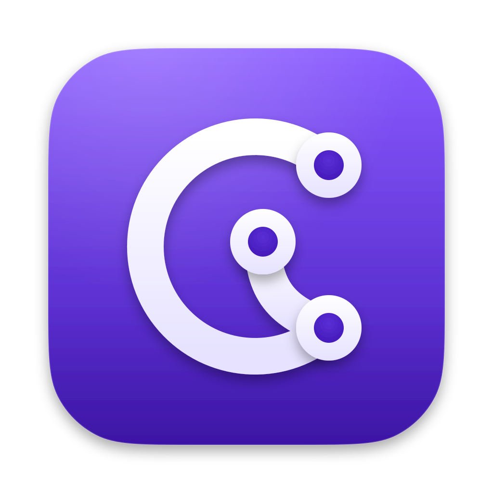

<p align="center"></p>

# Corvane

A native, fast, low-memory [GitHub Desktop](https://github.com/apps/desktop) clone written in [Rust](https://rust-lang.org/).

The UI is a one-to-one recreation of [GitHub Desktop 3.6.6](https://github.com/desktop/desktop/releases/tag/release-3.6.6): same layout, buttons, menus, dialogs and workflow. The engine is different: [GPUI](https://gpui.rs/) ([Zed](https://zed.dev/)'s GPU-accelerated UI framework) for rendering, [gitoxide](https://github.com/gitoxidelabs/gitoxide) for in-process git reads, and the [git](https://git-scm.com/) CLI for writes so behaviour matches GitHub Desktop exactly.

Status: pre-release. Feature-complete with GitHub Desktop 3.6.6 on macOS, minus a few gaps. Linux ([X11](https://en.wikipedia.org/wiki/X_Window_System) and [Wayland](https://wayland.freedesktop.org/), x86_64 and arm64) runs the same app with GitHub Desktop's Linux menus and wording; it is newer and not yet pixel-identical to GitHub Desktop everywhere (expect <5% differences). Binaries for both are on [GitHub Releases](https://github.com/wasi-master/corvane/releases). [Android](https://www.android.com/) (phones, tablets, [Chromebooks](https://www.google.com/chromebook/)) is experimental, with packages on the same page. Windows is planned.

## Requirements

### macOS

- macOS 10.15.7 Catalina or newer on Intel, macOS 11 or newer on [Apple Silicon](https://support.apple.com/en-us/116943)
- `git` 2.38+ on your `PATH`: the [Xcode Command Line Tools](https://developer.apple.com/documentation/xcode/installing-the-command-line-tools) from Xcode 14.3 on ship 2.39, or use [Homebrew](https://brew.sh/)'s

### Linux

- A distribution with [glibc](https://sourceware.org/glibc/) 2.35 or newer ([Ubuntu 22.04](https://releases.ubuntu.com/jammy/), [Debian 12](https://www.debian.org/distrib/), [Fedora 36](https://fedoraproject.org/) or later), on x86_64 or arm64
- An X11 or Wayland session, and a [Vulkan](https://www.vulkan.org/) driver (Mesa's drivers work)
- A [Secret Service](https://specifications.freedesktop.org/secret-service-spec/latest/) keyring for signed-in accounts: [GNOME Keyring](https://wiki.gnome.org/Projects/GnomeKeyring), [KWallet](https://apps.kde.org/kwalletmanager5/) or [KeePassXC](https://keepassxc.org/)
- `git` 2.40+ on your `PATH`; Ubuntu 22.04 ships an older git, so use the [git-core PPA](https://launchpad.net/~git-core/+archive/ubuntu/ppa) there

### Android

- Android 8.0 or newer on arm64, armv7, x86_64 or x86, with a [Vulkan](https://www.vulkan.org/) driver ([OpenGL ES](https://www.khronos.org/opengles/) is the fallback)
- Nothing else: git, [OpenSSH](https://www.openssh.com/) and [Git LFS](https://git-lfs.com/) are included inside the app prebuilt

## Install

### macOS

[Homebrew](https://brew.sh/) (recommended; the cask clears the quarantine attribute, so [Gatekeeper](https://support.apple.com/guide/security/gatekeeper-and-runtime-protection-sec5599b66df/web) does not block the unnotarized app):

```bash
brew install --cask wasi-master/corvane/corvane
```

Direct download from [GitHub Releases](https://github.com/wasi-master/corvane/releases): after the first launch is blocked, open System Settings → Privacy & Security and click "Open Anyway" (on macOS 14 and older, right-click the app and choose Open), or run `xattr -d com.apple.quarantine /Applications/Corvane.app`.

### Linux

[Homebrew](https://brew.sh/) (x86_64 and arm64; installs the AppImage as `~/Applications/Corvane.AppImage`, `brew upgrade corvane` updates it):

```bash
brew install --cask wasi-master/corvane/corvane
```

Or download the `.deb` or the AppImage for your architecture from [GitHub Releases](https://github.com/wasi-master/corvane/releases).

- Debian and Ubuntu: `sudo apt install ./corvane_<version>_amd64.deb` (`arm64` on ARM). Install a newer `.deb` the same way to update.
- Any distribution: `chmod +x Corvane-<version>-x86_64.AppImage` (`aarch64` on ARM), then run it. The AppImage updates itself in place.

An AppImage (from Homebrew or downloaded) adds itself to the application menu and registers the `x-corvane://` links on first launch: it writes `~/.local/share/applications/com.wasimaster.corvane.desktop` and its icon under `~/.local/share/icons/hicolor`, and updates them when you move the file. It leaves this to [AppImageLauncher](https://github.com/TheAssassin/AppImageLauncher) or appimaged when one of them already added the AppImage. Delete those files to remove the entry (`brew uninstall --zap corvane` does).

File → Install Command Line Tool links `corvane` into `~/.local/bin`, the same command line tool GitHub Desktop has. A Flatpak is not available yet.

### Android

Download `Corvane-<version>-android-foss-arm64.apk` (most phones and tablets; `-armv7` for 32-bit ones, `-x86_64` for most Chromebooks and emulators, `-universal` has every architecture) from [GitHub Releases](https://github.com/wasi-master/corvane/releases) and open it; Android asks once to let your browser or file manager install apps. Install a newer package the same way to update: repositories, accounts and settings stay. The play package next to it is the Google Play flavour, without "All files access". Android support is experimental and was tested on few devices, so expect rough edges.

## Building

```bash
cargo run -p corvane
```

On Linux, install the build dependencies first (Debian and Ubuntu package names):

```bash
sudo apt install clang mold pkg-config libxcb1-dev libxkbcommon-dev libxkbcommon-x11-dev \
  libwayland-dev libfontconfig-dev libfreetype-dev libvulkan-dev
```

On macOS, development builds compile [Metal](https://developer.apple.com/metal/) shaders at runtime so a full [Xcode](https://developer.apple.com/xcode/) install is not required. Release builds in CI use precompiled shaders (`--no-default-features`).

### Android

With the [Android SDK](https://developer.android.com/studio) and [NDK 27.3.13750724](https://github.com/android/ndk/wiki/Unsupported-Downloads#r27d) (`ANDROID_HOME`, `ANDROID_NDK_HOME`), a [JDK 17](https://www.oracle.com/apac/java/technologies/downloads/) or newer (`JAVA_HOME`), [make](https://developers.make.com/make-cli), [perl](https://www.perl.org/), [Go](https://go.dev/) and [cargo-ndk](https://github.com/bbqsrc/cargo-ndk):

```bash
rustup target add aarch64-linux-android x86_64-linux-android
cargo install cargo-ndk
packaging/android/build.sh profiling foss
adb install packaging/android/app/build/outputs/apk/foss/debug/app-foss-debug.apk
```

The first run also cross-builds what the app bundles: git, curl, OpenSSL, OpenSSH and Git LFS. `profiling` puts the optimised library into a debug-signed package, ready for a device at hand; `release` is signed only when the `CORVANE_ANDROID_KEYSTORE` variables are set (see `packaging/android/build.sh`). `ABIS=arm64-v8a` builds one architecture only, and `play` instead of `foss` is the flavour for Google Play (no "All files access", grammars as an on-demand module).

## License

MIT. See [LICENSE](LICENSE) and [NOTICE](NOTICE).

## Trademarks

Corvane is an independent project. It is not affiliated with, sponsored by or endorsed by GitHub, Inc. GitHub® and GitHub Desktop are trademarks of GitHub, Inc.; they are used here only to describe what Corvane recreates and works with. Corvane does not ship GitHub's logos (the Invertocat or Octocat marks).
